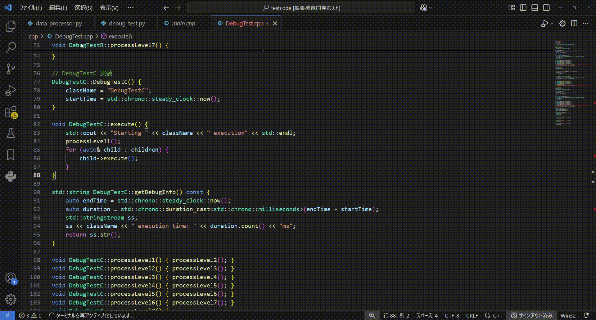

# Code Vision - Visual Studio Code拡張機能

[](https://marketplace.visualstudio.com/items?itemName=CodeVision.codevision)
[](https://marketplace.visualstudio.com/items?itemName=CodeVision.codevision)
[](https://marketplace.visualstudio.com/items?itemName=CodeVision.codevision)

## 概要

Code Visionは、Visual Studio Codeの拡張機能で、コードベース内の関数呼び出し関係をバタフライグラフ(コールツリー)として視覚化します。この視覚化により、選択した関数の呼び出し元と呼び出し先を表示することで、開発者がコードをより理解しやすく、探索しやすくなります。



## 機能

- **インタラクティブな関数呼び出しの視覚化**
  - 関数呼び出し関係をバタフライグラフ形式で表示
  - 中央ノードに選択した関数を表示
  - 左側に呼び出し元関数を表示
  - 右側に呼び出し先関数を表示

- **対応言語**
  - C/C++
  - Python
  - （今後、他の言語にも対応予定）

- **主要機能**
  - 任意の関数を右クリックしてバタフライグラフを表示
  - ノードをダブルクリックして関数定義にジャンプ
  - 呼び出し元と呼び出し先の階層深度を設定可能
  - 階層ごとの表示関数数の上限をカスタマイズ可能

## インストール方法

1. Visual Studio Codeを開く
2. `Ctrl+P`を押してクイックオープンダイアログを開く
3. 以下のコマンドを貼り付けてEnterを押す：
   ```
   ext install CodeVision
   ```
4. インストールボタンをクリック

## 使用方法

1. 対応しているソースコードファイルを開く
2. 任意の関数を右クリック
3. コンテキストメニューから「バタフライグラフを表示」を選択
4. バタフライグラフが新しいパネルに表示される

### 基本操作

- **ノードをダブルクリック**: 関数定義にジャンプ
- **マウスホイール**: ズームイン/アウト
- **クリック＆ドラッグ**: ノードを動かす

## 設定

拡張機能はVS Codeの設定から設定できます：

```json
{
  "butterflyGraph.callerLevels": 2,        // 呼び出し元の階層数
  "butterflyGraph.calleeLevels": 2,        // 呼び出し先の階層数
  "butterflyGraph.maxNodesPerLevel": 10,   // 階層ごとの最大ノード数
  "butterflyGraph.theme": "default"        // グラフの配色テーマ
}
```

## 必要条件

- Visual Studio Code 1.99.1以上
- プログラミング言語のLanguage Server Protocol (LSP)サポート
  - C/C++の場合: "C/C++"拡張機能（ms-vscode.cpptools）をインストール
  - Pythonの場合: "Python"拡張機能（ms-python.python）をインストール

## 既知の問題

- 大規模なコードベースではパフォーマンスが低下する可能性があります
- 一部の動的言語機能は完全にはサポートされていない可能性があります
- 特定の言語固有の機能のサポートが限定的です

## 貢献

貢献を歓迎します！詳細は[貢献ガイドライン](CONTRIBUTING.md)をご覧ください。

1. リポジトリをフォーク
2. 機能ブランチを作成（`git checkout -b feature/amazing-feature`）
3. 変更をコミット（`git commit -m 'Add some amazing feature'`）
4. ブランチにプッシュ（`git push origin feature/amazing-feature`）
5. プルリクエストを作成

## ライセンス

このプロジェクトはMITライセンスの下で公開されています - 詳細は[LICENSE](LICENSE)ファイルを参照してください。

## 謝辞

- グラフ視覚化に[Cytoscape.js](https://js.cytoscape.org/)を使用
- VS Code拡張機能API
- Language Server Protocol

---

**注意**: この拡張機能は現在開発中です。一部の機能は今後のアップデートで変更または追加される可能性があります。 